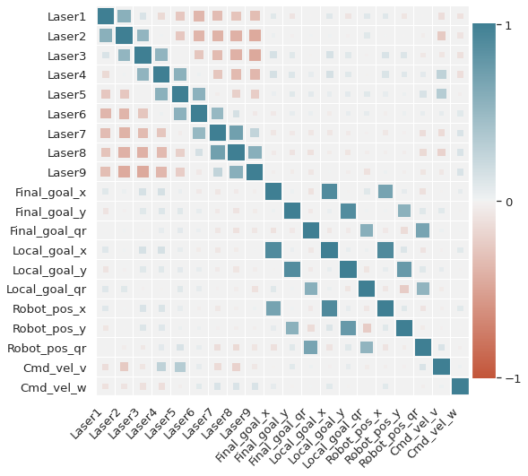
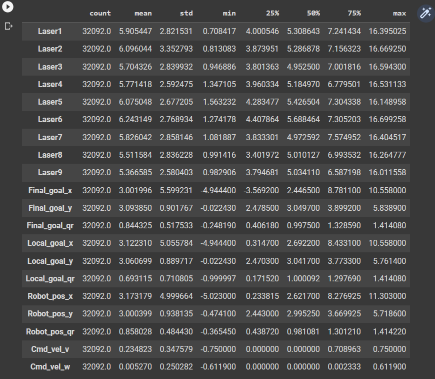
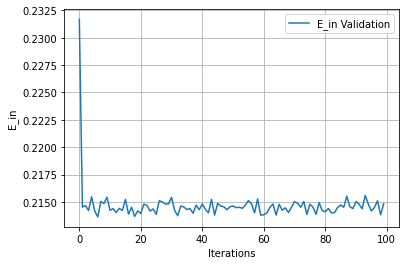
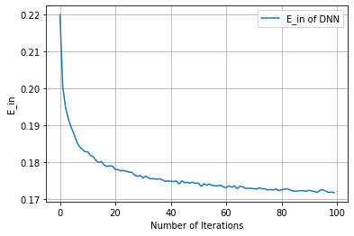
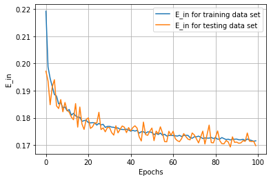
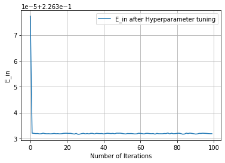
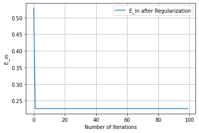

# Data-driven-motion-planning-using-various-machine-learning-algorithms

[](https://lbesson.mit-license.org/)

## Introduction

The objective of the project is to perform path planning for a four-wheel vehicle with nonholonomic
constraints, using Machine Learning, I shall use different ML Models like LInear Regression and DNN to predict the outputs properly. After checking the perfomance of both the models, the one with a better result will be finalized to train with more data and will be tested and optimized. The model is being trained and tested on real-time data that has been captured using Laser scan.

## Personnel

* **Bharadwaj Chukkala** `<br>`
  UID: 118341705 `<br>`
  Bharadwaj Chukkala is currently a Master's student in Robotics at the University of Maryland, College Park, MD (Batch of 2023). His interests include Machine Learning, Perception and Path Planning.`<br>`
  [](bchukkal@umd.edu)
  [](https://www.linkedin.com/in/bharadwaj-chukkala/)
  [](https://github.com/bharadwaj-chukkala)

## Contents

```
├───bchukkal_final_project_report.pdf
├───bchukkal_final_project_presentation.pptx
├───LICENSE
├───README.mdta
├───codes
|   ├───data_preprocessing.py
|   ├───feature_engineering.py
|   ├───finalized_model.py
|   ├───linear_regression_model.py
│   └───neural_network_model.py
├───Data
│   ├───Test Dataset
│   └───Train Data set
├───image
│   └───README
└───results
```

## Requirements/Dependencies

To run this project, you will need the following:

- [Python 3.6+](https://www.python.org/downloads/)
- TensorFlow `python3 -m pip install tensorflow`
- Scikit Learn `pip install -U scikit-learn`
- [Training Data](https://drive.google.com/drive/folders/1IgiPMaMyktjIa9qH-5qqSjwFuew9TiPW)
- [Test Data](https://drive.google.com/drive/folders/1IhVbX1VwAQf4WzamN8m81sNQTABDWw5y)

## Setup

1. Clone this repository to your local machine
   ```
   git clone https://github.com/bharadwaj-chukkala/Data-driven-motion-planning-using-various-machine-learning-algorithms.git
   cd Data-driven-motion-planning-using-various-machine-learning-algorithms
   ```
2. Install the required libraries using `pip install`
3. Download the dataset and place it in the `data` directory, there are already existing datasets present in the repository which you can choose to change.
4. The `Data` directory contains two folders `Train Data Set ` and `Test Dataset`.
5. Both the dataset folders contain two csv files each.
   1. The `Train Data Set` contains two csv files `July22_69` and `Training_set_merged`. Here the former is raw unprocessed data and the latter is clean and processed data on which we train our model.
   2. The `Test Dataset` contains two csv files `July22_68` and `Test_set_merged`. Here the former is raw unprocessed data and the latter is clean and processed data on which our model makes predictions.

## Instructions

### Pipeline to be followed

* Data Preprocessing
* Feature Engineering
* Training different models:
  * Linear Regression model
  * Neural Network model
* Finalizing the model
* Prediction Testing
* Hyperparameter Tuning
* Regularization
* Generalization

#### Data Preprocessing

1. Open the `codes` directory and open the `data_preprocessing.py` and give the path to the datasets as per the need.
2. run the `data_preprocessing.py` file
3. The preprocessed data wil be generated in the root directory.

   ```
   cd codes
   code .                         #Opens the folder in VSCode
   python3 daata_preprocessing.py
   ```

#### Feature Engineering

1. Open the `codes` directory and open the `feature_engineering.py` and give the path to the pre processed datasets as needed.
2. run the `feature_engineering.py` file
3. The extracted data will then be genrated in the root directory

   ```
   cd codes
   code .                          #Opens the folder in VSCode
   python3 feature_engineering.py
   ```

#### Training the Models

Open the `codes` directory

1. Linear regression

   * Open the `linear_regression_model.py` specify the path to the engineered dataset
   * Run the training script using `python3 linear_regression_model.py `
2. Neural Network

   * Open the `neural_network_model.py` specify the path to the engineered dataset
   * Run the training script using `python3 neural_network_model.py`

#### Testing with the Final Model

1. Once the model is trained, you can use it to make predictions on new data.  Open the `codes` directory
2. Open the `finalized_model.py` and specify the path to the engineered `test` dataset
3. Run the test script using `python3 finalized_model.py`

## Results

The performance of the trained model will be evaluated using metrics such as accuracy, precision, and recall.

#### Figures

* ##### Cross-correlation heat map

  
* ##### Standard deviation chart of laser

  
* ##### $E_{in}$ vs $Epochs$

  * **Linear Regression**

    
  * **Deep Neural Network**

    
* ##### Learning Curves [Train and Test]

  
* ##### Hyperparameter Tuning

  
* ##### Regularization

  

## Conclusion

We have successfully followed the machine learning pipeline to develop a model for estimating the ’command actions’ for the car-like robot model. The trained model is computationally reasonable by decreasing the number of features considered and a proper generalization has been shown as indicated by the results.

---

Thank you for using this project.

Copyrights 2022: @bharadwaj-chukkala
